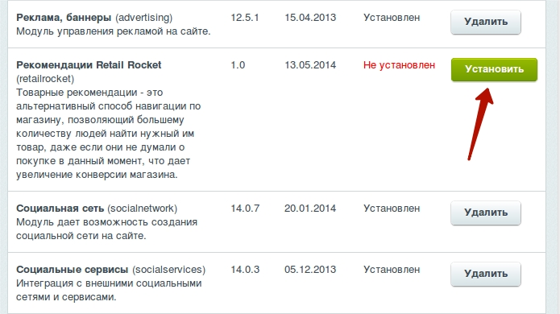
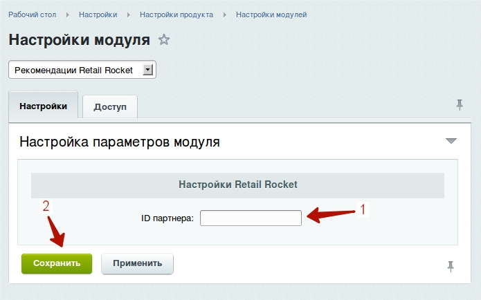
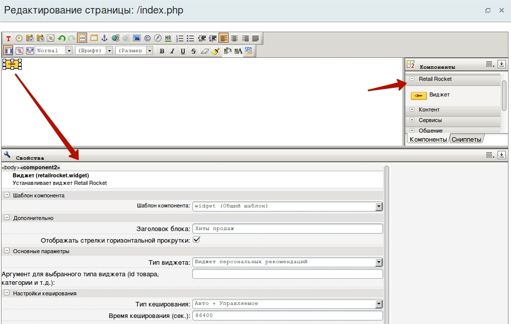

# bitrix-retailrocket-api
Модуль API к RetailRocket.ru для Bitrix


## Минимальные требования
* PHP 5.4;
* Bitrix D7.

## Установка
####1. Модуль `retailrocket` скопировать в папку `/local/modules`;

####2. Инсталлировать модуль из админ панели;



####3. Указать ID магазина, присвоенный системой RetailRocket, в настройках модуля.



####4. Разместить код в шаблоне (должен выводиться на каждой странице):
```php
<!-- Retail Rocket -->
<?php
if (\Bitrix\Main\Loader::includeModule('retailrocket')) {
	echo new \RetailRocket\Js\TrackingCode;
}
?>
<!-- End Retail Rocket -->
```

####5. Разместить компоненты на необходимых страницах



## Доступные виджеты
* Виджет главной страницы
* Виджет персональных рекомендаций
* Виджет товарной категории
* Виджет карточки товара
* Виджет карточки отсутствующего в наличии товара
* Виджет корзины
* Виджет внутреннего поиска

## Tracking
Для формирования товарных рекомендаций, система Retail Rocket использует информацию о поведении пользователей, которая собирается с помощью JavaScript счетчика.
Для размещения необходимых счетчиков используйте методы класса `\RetailRocket\Js\TrackingCode`:

* Код обработчика просмотра карточек товаров
* Код обработчика просмотра страницы товарной категории
* Код обработчика добавления товаров в корзину
* Добавление товара в корзину из блока с рекомендациями
* Клик по гиперссылке с товарной рекомендацией
* Код обработчика совершения транзакции
* Показ товарных рекомендаций
